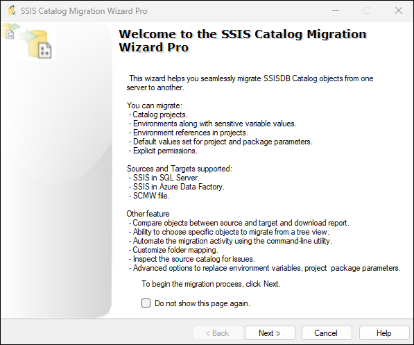

# SSIS Catalog Migration Wizard

SSIS Catalog Migration Wizard helps you migrate SSIS Catalog from one server to another It is an add-in for SSMS 18, 19, Visual Studio 2017, 2019 or 2022.
{: .fs-6 .fw-300 }

[Get started now](https://ssiscataloger.azureops.org/download/){: .btn .btn-primary .fs-5 .mb-4 .mb-md-0 .mr-2 }
[View it on Visual Studio Marketplace](https://marketplace.visualstudio.com/items?itemName=AzureOps.ssiscatalogerpro)]{: .btn .fs-5 .mb-4 .mb-md-0 }

---

## Supported Sources and Targets
- **SSIS for SQL Server**: SSIS catalog enabled in SQL Server. 
- **SSIS for Azure Data Factory**: This is used when running SSIS packages in Azure using Azure data factory pipelines.
- **SCMW export**: This is a unique export format for SSIS Catalog items.

## Key Features
- **Compare source and target catalog**: Compare source and target and choose to migrate only what has changed.
- **Customize SSIS folder names on the go**: Quickly map source and target folder names. The wizard populates all selected folder names in Source and Target folder columns. If you wish to customize the folders, edit the value in the ‘Target Folder’ column.
- **Replace SSIS environment variable values on the go**: Configure the key-value pairs you want to replace in the environment variable and parameter values. Suggest button will list suggestions for replacing values based on the selected Replace Scope.
- **Export, import, or delete SSISDB items in bulk**: Whether you want to keep the backup of SSIS catalog items or migrate SSISDB items to a different network or domain, SCMW file export covers this.
- **Inspect existing SSISDB for issues**: [Detect](https://azureops.org/articles/is-your-ssis-catalog-migration-ready/) critial issues in existing SSISDB before migration. 
- **Migrate catalog items to the same server**: Migrate SSIS Catalog items on the same SQL server but to different folders.
- **Automate activities using the command-line utility**: With the command-line utility, we can automate routine migrations in a few clicks. The migration script can be integrated with any scheduler or CI-CD tool.
- **Validate migrated projects automatically**: You can choose to validate all the migrated projects automatically after their migration.

## How It Works
- **Select source**: Select source SQL Server containing SSISDB to be migrated.
- **Provide target**: Select target SQL Server where you want to migrate SSISDB.
- **Manage migration settings**: Perform selection of SSISDB items and manage environment variables and parameter values update rules.

## Getting Started
1. **Install the Extension**: Get started by [installing](https://ssiscataloger.azureops.org/download.html)  the extension.
2. **Explore Documentation**: [Refer](https://ssiscataloger.azureops.org/getting-started) to our detailed documentation for step-by-step guides.

